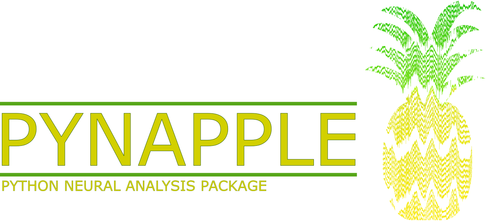

<!--  -->

  

## Welcome to the pynapple organization!  👋

Pynapple is a light-weight python library for neurophysiological data analysis. The goal is to offer a versatile set of tools to study typical data in the field, i.e. time series (spike times, behavioral events, etc.) and time intervals (trials, brain states, etc.). The [main code repo is here](https://github.com/pynapple-org/pynapple).

👩‍💻 [Read our documentation](https://pynapple-org.github.io/pynapple/) for how to get started and how to use pynapple.

🍿 Read the pynapple paper [here](https://www.biorxiv.org/content/10.1101/2022.12.06.519376v1)!

🧙 Check out the repos below to find helper code, additional tools, and more!

### Credits

Special thanks to Francesco P. Battaglia (<https://github.com/fpbattaglia>) for the development of the original [*TSToolbox*](<https://github.com/PeyracheLab/TStoolbox>) and [*neuroseries*](<https://github.com/NeuroNetMem/neuroseries>) packages, the latter constituting the core of *pynapple*.

This package was initially developped by Guillaume Viejo (<https://github.com/gviejo>) and other members of the Peyrache Lab. 

The development and maintenance is currently made at the [Center for Computational Neuroscience](https://www.simonsfoundation.org/flatiron/center-for-computational-neuroscience/) of the Simons foundation.

